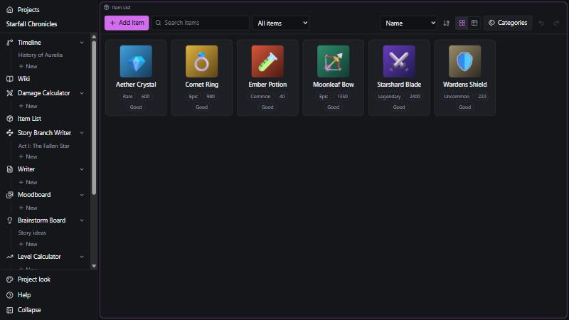
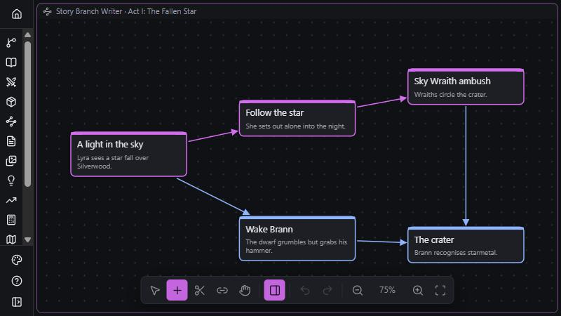
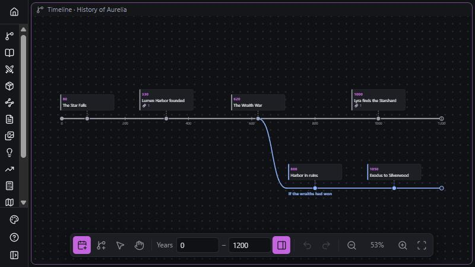
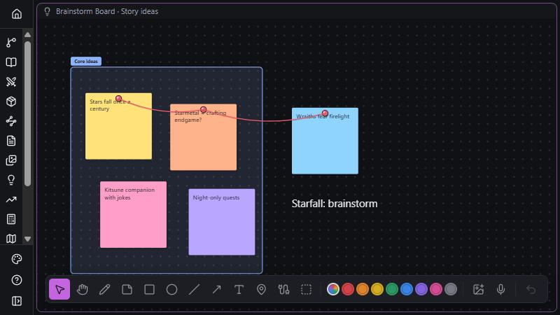
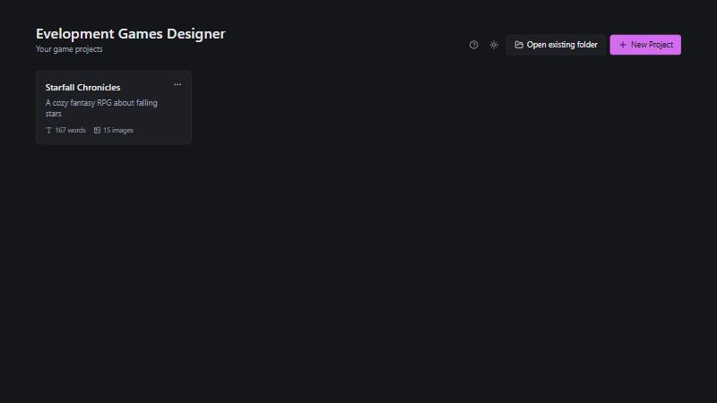
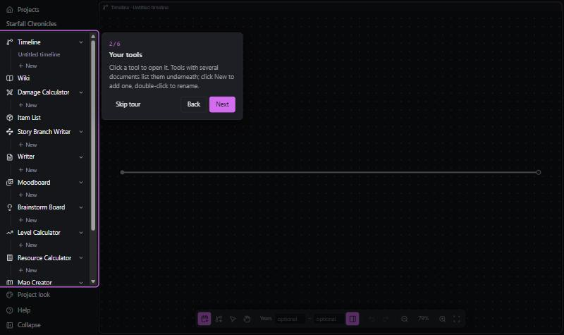
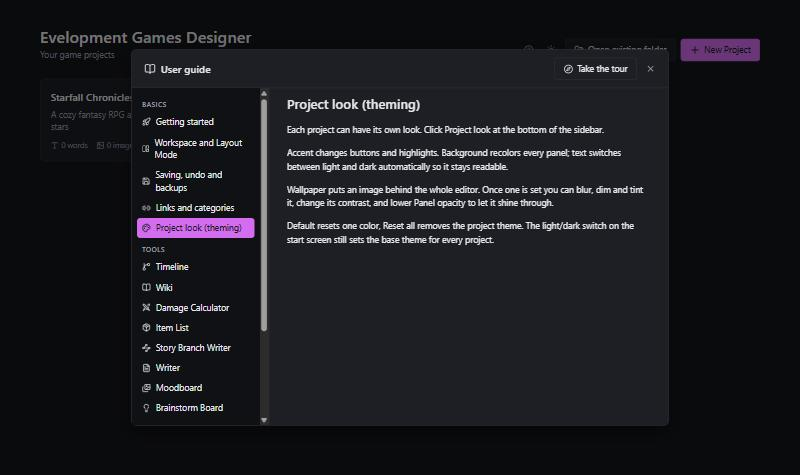

<p align="center">
  
</p>

<h1 align="center">Evelopment Games Designer</h1>

<p align="center">
  <a href="https://github.com/Evelynnsrepos/Evelopment-Games-Designer/releases/latest"><b>Download</b></a> ·
  <a href="#features">Features</a> ·
  <a href="#install">Install</a> ·
  <a href="#community">Community</a>
</p>

<p align="center">
  <a href="https://discord.gg/AGfaBwNKfN"></a>
  <a href="https://www.youtube.com/@EvelopmentGames"></a>
  <a href="https://www.instagram.com/evelopmentgames/"></a>
  
</p>

<p align="center">
  
</p>

**One program for designing your whole game.** Story, lore wiki, characters, towns, items, enemies, maps,
timelines, mood boards, brainstorm boards and balancing calculators all live in one project, and they all
know about each other. Free, open source, offline, for Windows, macOS and Linux.

> **Status:** early development. All 18 tools work, but expect rough edges and changes to the project format.

## Why

Designing a game usually means juggling a dozen apps: a wiki here, a spreadsheet for drop rates there, a
whiteboard app, a writing app, a map tool. Evelopment Games Designer keeps everything in one project, so an item you
create in the Item List can be linked from the Wiki, dropped by an enemy, and counted by the Resource Calculator.

## Features

| | |
|---|---|
|  |  |
| **Story Branch Writer**: branching stories as a mind map | **Timeline**: history with alternative branches |
|  |  |
| **Brainstorm Board**: notes, pins, string and areas | **Launcher**: all your game projects at a glance |
|  |  |
| **Guided tour** on first launch | **User guide** for every tool, built in (F1) |

### Workspace
- **Project launcher**: all your games at a glance, with word and image counts.
- **Add tool** at the bottom of the sidebar; right-click a tool to hide it (keeps its contents) or delete its contents.
- **Tiling editor**: open several tools side by side, drag a tool from the sidebar to split the screen, and resize the splits.
- **Layout Mode**: press `Esc` to close or rearrange tools with big, easy targets.
- **Auto-save** about a second after every edit, **undo/redo** in every tool, and **rolling backups** of the last 10 saves.
- **Work together**: share a project with an invite code and edit it live with others, peer to peer, on Windows, Mac and Linux. No account or server; offline changes merge when you reconnect.
- **Light and dark themes** (dark by default), plus a **Project look** per project: accent, background and wallpaper.
- **Guided tour** on first launch and a built-in **user guide** for every tool (press `F1` or click Help).
- **Click** a tool in the sidebar to show only that tool; **Shift-click** to open it next to the ones already open.
- **Spell check** in English and German with suggestions on right-click, your own word list, and names from your project counted as correct.
- Optional **AI helper** (a small model that runs on your computer, downloaded from Settings) that picks the best spelling for the sentence.
- **Export a project as a zip** and **import** it again, for backups or to send a project to someone.
- **Plugins** add new tools: install one from a GitHub link or a zip in Settings. See [docs/PLUGINS.md](docs/PLUGINS.md) to make your own.
- **Pen size, opacity and smoothing** sliders on every drawing canvas.

### The tools

| Tool | What it does |
|---|---|
| **Item List** | Every item in your game, with images, rarity, value, stats and your own custom categories. Shows which enemies drop each item. |
| **Character List** | Characters with portraits, family, nation, clan, race and links to other characters. |
| **Town List** | Towns with nation, race, religion and links. Cities placed on a map are towns. |
| **Enemy List** | Enemies with combat stats, growth per level, resistances, drop tables and where they are found. |
| **Wiki** | Articles with `[[links]]`, articles made from any item, character, town or enemy (with a live info box), backlinks and a connection map. |
| **Writer** | Rich text documents for design docs, scripts and dialogue, with live word count and Markdown/text export. |
| **Story Branch Writer** | Mind-map style branching stories: create, branch, connect and sever nodes. |
| **Timeline** | Timelines with optional years, events with images, and branches for alternative histories (press `B`). |
| **Moodboard** | Images, cutouts (shapes or freehand lasso), text, shapes and a layers panel, with an always-on-top layer for drawings. |
| **Brainstorm Board** | Drawing, sticky notes, shapes, images, audio clips and voice recording, pins with string, and named colored areas. |
| **Map Creator** | Cities, streets and terrain stamps on a blank map, with PNG export. Cities are linked to the Town List. |
| **Damage Calculator** | A library of game damage formulas (elemental reactions, armor, crits, damage over time, resistances), plus your own formulas. |
| **Level Calculator** | XP curves, stat growth, and damage per level against a fixed defense or an enemy from your Enemy List. |
| **Resource Calculator** | How many resources and how much play time a goal takes, using level-up costs and enemy drop rates. |
| **Cosmos Creator** | Universes, galaxies, solar systems, planets, moons and more in an isometric view: a node graph at the top level and orbits inside galaxies and solar systems, with moons around their planets and your own pictures for any body. |
| **Sketch** | Draw and paint like in Procreate: pressure brushes (pencil, ink, marker, paint, airbrush), layers with blend modes, alpha lock and clipping masks, selection, mirror, reference images, PNG export, and Send to other tools. |
| **Design Language** | The look of your game on one board. Works like the Moodboard: images, cutouts, and your Sketch drawings as stickers. |
| **Asset Pool** | Every asset the game still needs (icons, sprites, models, sounds, music…) with status and pictures. Add one for every item, character, town or enemy at once, or paste a checklist. |

### Everything is connected
- Custom categories (like *Element* or *Faction*) are created once and used on items, characters, towns and enemies.
- **Rarities**: as many rarity systems as you like (Rarity, Tier, Quality…) with colors, borders, icons or your own pictures, star or number ratings, and your own fields like drop rates. They show on cards, tables, pages, the wiki and links.
- `[[links]]` in the Wiki, Writer, Story and Timeline point at articles and entities, and follow renames.
- Before you delete something, the app shows every place it is used.

### Your data stays yours
Each project is a normal folder of JSON files plus an `assets/` folder, saved in
`Documents/Evelopment Games Designer/`. Easy to back up and readable, it works fully offline, and the app sends no telemetry.
The app only goes online when you share a project: teammates' computers then connect to each other directly and encrypted,
using public relay servers by [n0](https://n0.computer) only to find each other or when a direct connection is not possible. Relays cannot read your project.

## Community

Made by **Evelopment Games**. Follow along, share what you build, and suggest features:

- Discord: https://discord.gg/AGfaBwNKfN
- YouTube: https://www.youtube.com/@EvelopmentGames
- Instagram: https://www.instagram.com/evelopmentgames/

## Install

**Easiest:** download the installer for your system from the
[Releases page](https://github.com/Evelynnsrepos/Evelopment-Games-Designer/releases/latest):

| System | File |
|---|---|
| Windows | `*_x64-setup.exe` |
| macOS (Apple Silicon and Intel) | `*_universal.dmg` (read [Mac](#mac) below first) |
| Linux | `*.AppImage` (any distro) or `*.deb` |

Or build it from source as described below. It takes a few minutes the first time.

### 1. Install the prerequisites

**Windows 10/11**
1. [Node.js](https://nodejs.org) 20 or newer (the LTS installer is fine).
2. [Microsoft C++ Build Tools](https://visualstudio.microsoft.com/visual-cpp-build-tools/). In the installer, tick **Desktop development with C++**.
3. [Rust](https://rustup.rs): run the installer and keep the defaults. Or in a terminal: `winget install Rustlang.Rustup`
4. WebView2 is already part of Windows 10 and 11.

**macOS 10.13 or newer** (Apple Silicon or Intel)
1. Xcode Command Line Tools: in Terminal run `xcode-select --install`.
2. [Rust](https://rustup.rs): `curl --proto '=https' --tlsv1.2 https://sh.rustup.rs -sSf | sh`
3. [Node.js](https://nodejs.org) 20 or newer.

**Linux (Debian/Ubuntu)**

```bash
sudo apt update
sudo apt install libwebkit2gtk-4.1-dev build-essential curl wget file libxdo-dev libssl-dev libayatana-appindicator3-dev librsvg2-dev
curl --proto '=https' --tlsv1.2 https://sh.rustup.rs -sSf | sh
```

Then install [Node.js](https://nodejs.org) 20 or newer.

**Arch Linux**

The easy way: clone the code (step 2) and let `makepkg` build and install it as a normal package.
It pulls in everything it needs, and you get a menu entry and `pacman -R evelopment-games-designer` to uninstall.

```bash
sudo pacman -S --needed git base-devel
git clone https://github.com/Evelynnsrepos/evelopment-games-designer.git
cd evelopment-games-designer/packaging/arch
makepkg -si
```

To work on the code instead, install the prerequisites and follow steps 2 and 3:

```bash
sudo pacman -S --needed webkit2gtk-4.1 base-devel curl wget file openssl appmenu-gtk-module libappindicator-gtk3 librsvg xdotool rustup nodejs npm
rustup default stable
```

For other distributions, see the
[Tauri prerequisites](https://v2.tauri.app/start/prerequisites/#linux).

### 2. Get the code

```bash
git clone https://github.com/Evelynnsrepos/evelopment-games-designer.git
cd evelopment-games-designer
npm install
```

(Or use **Code → Download ZIP** on GitHub, unzip it, and run `npm install` inside the folder.)

### 3. Run or build it

Run the app directly:

```bash
npm run tauri dev
```

Or build an installer for your system:

```bash
npm run tauri build
```

The installers end up in `src-tauri/target/release/bundle/`:

| System | Files |
|---|---|
| Windows | `msi/*.msi` and `nsis/*-setup.exe` |
| macOS | `dmg/*.dmg` and `macos/*.app` |
| Linux | `appimage/*.AppImage` (runs on any distro) and `deb/*.deb` |

### Mac

Download the `.dmg` from the [Releases page](https://github.com/Evelynnsrepos/Evelopment-Games-Designer/releases/latest).
It runs on both Apple Silicon and Intel Macs.

Open the `.dmg` and drag the app into **Applications**. The app is not signed with a paid Apple developer
certificate, so the first time macOS will refuse to open it:

1. Open the app once. macOS says it can't be opened. Click **Done** (or **Cancel**).
2. Go to **System Settings → Privacy & Security**, scroll down and click **Open Anyway** next to
   *Evelopment Games Designer*, then confirm.

If macOS instead says the app "is damaged and can't be opened", that's the download quarantine flag. Clear it in Terminal:

```bash
xattr -dr com.apple.quarantine "/Applications/Evelopment Games Designer.app"
```

After that it opens normally. Apps you build yourself with `npm run tauri build` skip all of this.

### Just want to look around?

`npm install` then `npm run dev` opens the app in your web browser at http://localhost:5173 without Rust.
In the browser, projects are kept in browser storage instead of real folders, so use the desktop app for real work.

## For developers

```bash
npm test             # unit tests
npm run typecheck    # TypeScript
npm run lint         # oxlint
```

Built with [Tauri 2](https://tauri.app), React, TypeScript, [Konva](https://konvajs.org) and [TipTap](https://tiptap.dev).
The product spec is in [`docs/SPEC.md`](docs/SPEC.md), and [`AGENTS.md`](AGENTS.md) explains how the code is organised.

Found a bug or have an idea? Please [open an issue](../../issues) or come say hi on [Discord](https://discord.gg/AGfaBwNKfN).
Pull requests are welcome.

## License

[GNU General Public License v3.0](LICENSE) © 2026 Evelopment Games.

Evelopment Games Designer is free and open source. You may use, study, share and change it. If you share a
changed version, it must also be released under the GPL-3.0 with its source code.
